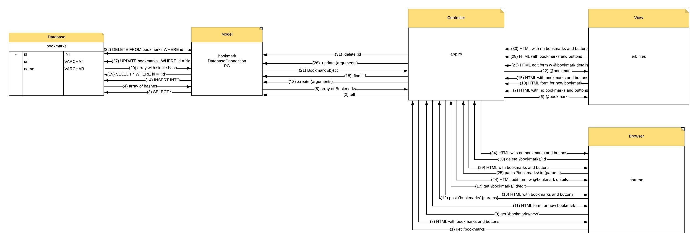

# Bookmark Diagram

## Description

* A diagram displaying the flow of data from user action to server resource and back, in my bookmark_manager app.
* Part of my work for Makers Academy, intended to gather feedback on my ability to model web applications.

## How to Use

* Open the image below, and follow the numbered arrows to trace the flow of data through the app as the user creates, views, edits and deletes a bookmark.

